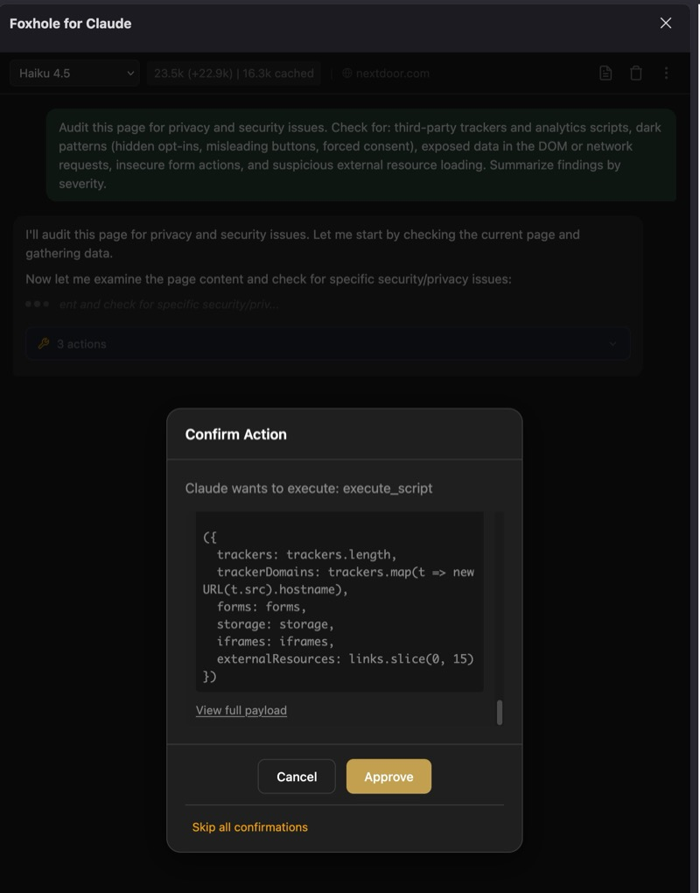
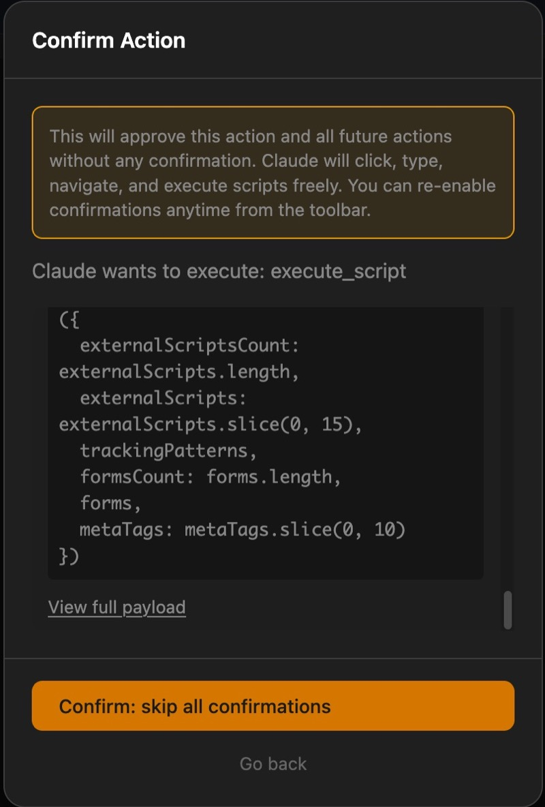
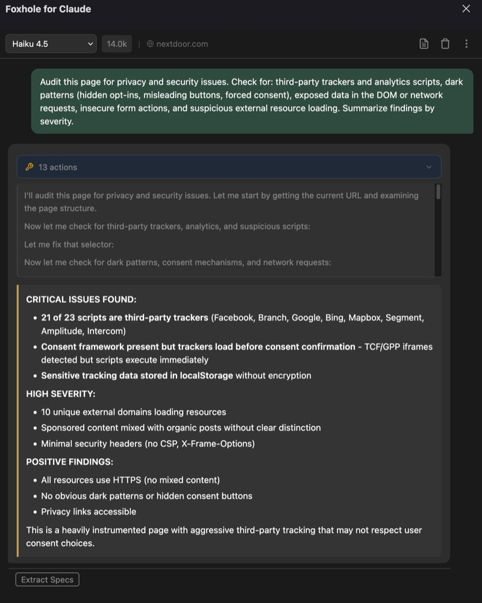
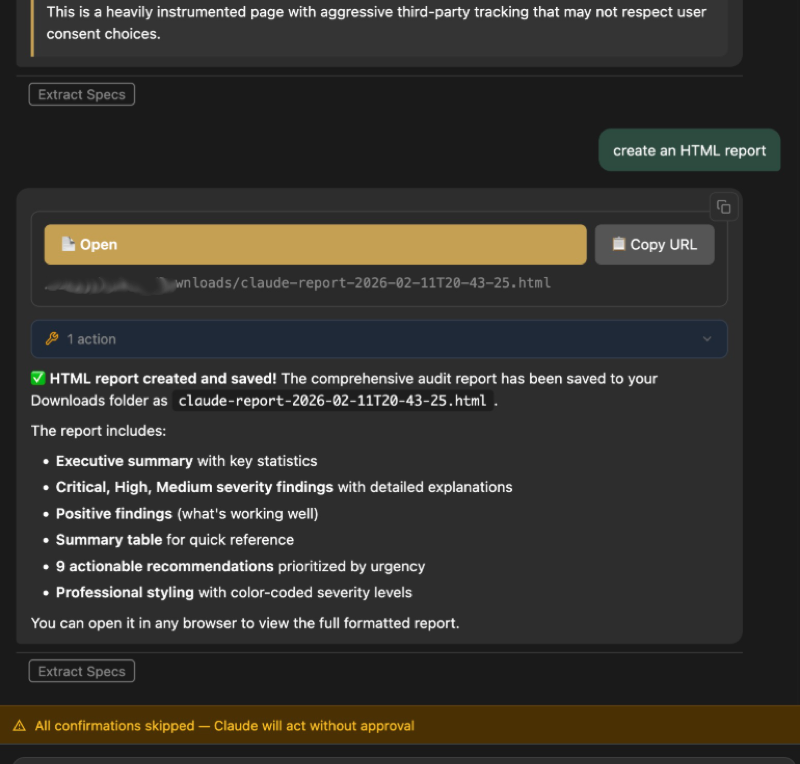
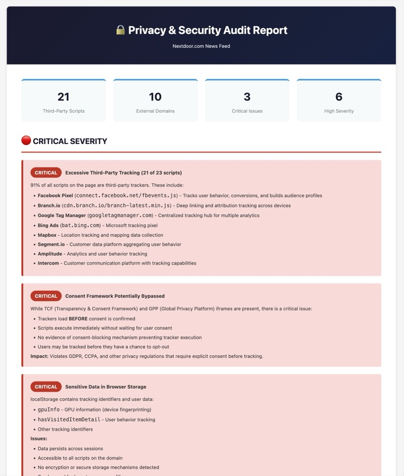

# Foxhole for Claude

A Firefox sidebar extension that gives Claude direct control over your browser through 62 automation tools. BYOK — bring your own Anthropic API key.

## What It Does

You chat with Claude in a sidebar. Claude can see, navigate, click, type, extract, and manipulate any page you're on. It decides which tools to call, executes them, reads the results, and iterates autonomously until the task is done.

## Core Capabilities

**Browser Automation** — Claude navigates pages, clicks elements, fills forms, types text, presses keys, scrolls, hovers, selects options, and checks boxes. All via CSS selectors.

**DOM Inspection** — Full read access to page structure: query selectors, element properties, computed styles, bounding rects, frame enumeration, and DOM stats. Structured tree extraction at configurable depth.

**Visual Analysis** — Viewport screenshots, element-level screenshots, and direct image reading from `` elements or URLs. Images are sent as vision blocks for Claude to analyze, OCR, or describe.

**Data Extraction** — Execute arbitrary JavaScript in page context. Read cookies, localStorage, sessionStorage. Intercept and inspect network requests. Read clipboard. Fetch external URLs.

**File Output** — Generate markdown or HTML files from extracted content. Downloads are managed and openable from the sidebar.

**Site Knowledge** — Persistent per-domain knowledge base. Claude learns CSS selectors, workflows, and gotchas about sites and injects them into future conversations on that domain. Survives across sessions.

**Multi-Image Input** — Queue multiple screenshots and pasted images before sending. All images are included as separate vision blocks in a single message.

**Context Management** — Automatic conversation compression when approaching context limits. Sliding-window task history. Prompt caching for reduced API costs.

## Tool Reference (62 tools)

| Category | Tools |
|----------|-------|
| **Tabs** | `list_tabs` `get_active_tab` `switch_tab` `create_tab` `close_tab` |
| **Navigation** | `navigate` `reload_page` `go_back` `go_forward` `get_current_url` `get_page_title` |
| **DOM** | `dom_stats` `get_page_content` `get_dom_structure` `query_selector` `get_element_properties` `get_computed_styles` `get_element_bounds` `list_frames` |
| **Interaction** | `click_element` `type_text` `fill_form` `scroll_to` `hover_element` `focus_element` `press_key` `select_option` `set_checkbox` |
| **Vision** | `take_screenshot` `take_element_screenshot` `read_image` |
| **Output** | `create_markdown` `create_html` `open_download` |
| **Cookies** | `get_cookies` `set_cookie` `delete_cookie` |
| **Storage** | `get_local_storage` `get_session_storage` `set_storage_item` `clear_storage` |
| **Script** | `execute_script` |
| **Waiting** | `wait_for_element` `wait_for_navigation` `wait` |
| **Network** | `get_network_requests` `clear_network_requests` `get_network_request_detail` `set_request_headers` `block_urls` |
| **Clipboard** | `read_clipboard` `write_clipboard` |
| **Buffers** | `query_buffer` `clear_buffer` |
| **Knowledge** | `save_site_spec` |
| **Fetch** | `fetch_url` |
| **Marking** | `mark_elements` `get_marked_elements` `clear_marked_elements` |
| **Selection** | `toggle_selection_mode` `get_user_selections` `clear_user_selections` |

## Permission Model

Two autonomy modes, toggled in the toolbar:

- **Confirm risky actions** (default) — High-risk tools (click, type, navigate, execute_script, fill_form, press_key) show a confirmation dialog. Configurable in settings.
- **Skip all confirmations** — Everything auto-executes.

Tool iteration limits are configurable with an interactive prompt when the limit is reached (continue, add more, unlimited, or stop with summary).

## Example: Security Audit

Claude autonomously inspects scripts, trackers, consent mechanisms, and storage — then generates a downloadable HTML report.

## Installation

1. Open `about:debugging#/runtime/this-firefox`
2. Click "Load Temporary Add-on"
3. Select `manifest.json` from this directory
4. Click the Foxhole icon → configure your API key in Settings

**Requirements:** Firefox 91+, Anthropic API key.

## Architecture

Firefox WebExtension (Manifest V2). No build step — raw JS/CSS/HTML.

| Layer | Path | Role |
|-------|------|------|
| Background | `background/` | API calls, tool routing, site knowledge |
| Content Script | `content/` | Executes in page context (DOM, clicks, screenshots) |
| Sidebar | `sidebar/` | Chat UI, toolbar, modals, tab management |
| Options | `options/` | Settings (API key, model, high-risk tools) |

See [CLAUDE.md](CLAUDE.md) for development conventions.

## Privacy

All data stays local. The only external communication is with the Anthropic API using your key. See [PRIVACY.md](PRIVACY.md).

## License

MIT. See [LICENSE](LICENSE).
