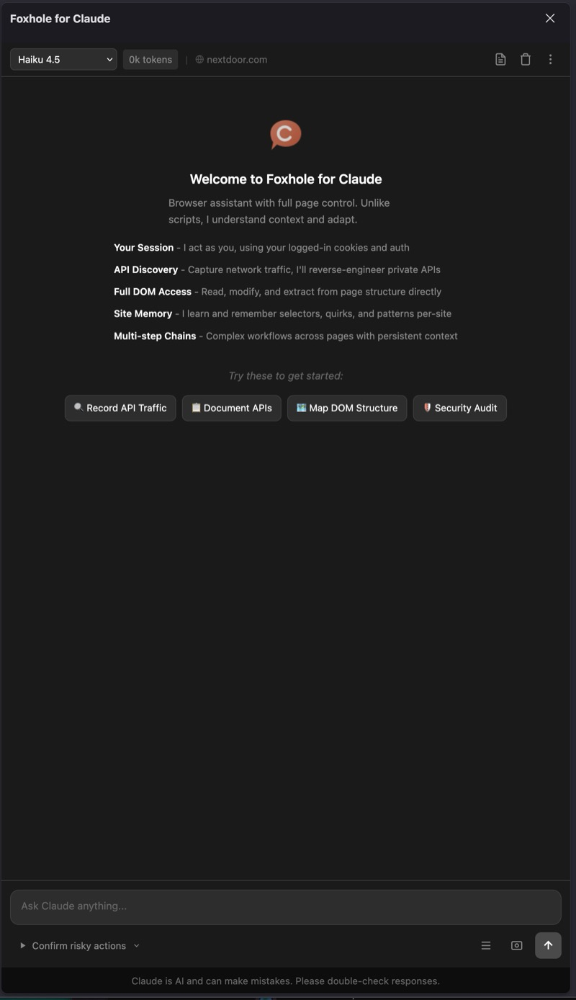

# Foxhole for Claude

A Firefox sidebar where Claude learns how each website works and remembers it across sessions.

Instead of rediscovering the same selectors, endpoints, and interaction patterns every time, Claude builds persistent site knowledge — profiles, working selectors, API endpoints, multi-step workflows — and uses them on the next visit.



## What makes this different

- **Site profiles** — Claude detects whether a site is UI-driven (React SPA), API-driven, or hybrid, and saves that as a profile. Next visit, it knows the interaction model upfront.
- **Persistent site specs** — Working selectors, API endpoints, storage keys, and workflows are saved per-domain and injected into every conversation on that site.
- **Spec staleness** — Old specs get flagged. Claude can delete broken ones and save corrected versions instead of working around stale knowledge.
- **Assistant, not automation** — Claude asks you to handle age gates, logins, CAPTCHAs, and location selectors instead of flailing through them. One click from you beats five tool calls.
- **First-visit discovery** — On new sites, Claude probes the DOM for the framework, checks API observer data, and determines the interaction mode before guessing.
- **Prompt injection defense** — Page content is sanitized, marked as untrusted, and wrapped in boundaries before Claude sees it.
- **Context compression** — Screenshots and raw payloads are replaced with semantic summaries in older turns so conversations stay within context limits.

## Install

```
git clone https://github.com/DrBenedictPorkins/foxhole-claude.git
```

1. Firefox → `about:debugging#/runtime/this-firefox` → Load Temporary Add-on → select `manifest.json`
2. Click the sidebar icon → Settings → enter your Anthropic API key

Requires your own [Anthropic API key](https://console.anthropic.com/).

## Tools (70)

| Category | Tools |
|----------|-------|
| Tabs | `list_tabs` `get_active_tab` `switch_tab` `create_tab` `close_tab` |
| Navigation | `navigate` `reload_page` `go_back` `go_forward` `get_current_url` `get_page_title` |
| DOM | `dom_stats` `get_page_content` `get_dom_structure` `query_selector` `get_element_properties` `get_computed_styles` `get_element_bounds` `list_frames` |
| Interaction | `click_element` `type_text` `fill_form` `scroll_to` `hover_element` `focus_element` `press_key` `select_option` `set_checkbox` |
| Vision | `take_screenshot` `take_element_screenshot` `read_image` |
| Output | `create_markdown` `create_html` `open_download` |
| Cookies | `get_cookies` `set_cookie` `delete_cookie` |
| Storage | `get_local_storage` `get_session_storage` `set_storage_item` `clear_storage` |
| Browsing Data | `clear_browsing_data` `list_indexeddb` `clear_indexeddb` `list_cache_storage` `clear_cache_storage` `search_history` `delete_history` |
| Script | `execute_script` |
| Wait | `wait_for_element` `wait_for_navigation` `wait` |
| Network | `get_network_requests` `clear_network_requests` `get_network_request_detail` `set_request_headers` `block_urls` |
| Clipboard | `read_clipboard` `write_clipboard` |
| Buffers | `query_buffer` `clear_buffer` |
| Knowledge | `save_site_spec` `delete_site_spec` |
| Fetch | `fetch_url` |
| Marking | `mark_elements` `get_marked_elements` `clear_marked_elements` |
| Selection | `toggle_selection_mode` `get_user_selections` `clear_user_selections` |

Two autonomy modes: **confirm risky actions** (default) or **skip all confirmations**.

## Architecture

Manifest V2 WebExtension. Raw JS/CSS/HTML — no bundler, no build step.

| Layer | Path | Role |
|-------|------|------|
| Background | `background/` | API calls, tool routing, site knowledge, prompt injection defense, context compression |
| Content Script | `content/` | Page context execution, DOM cleaning |
| Sidebar | `sidebar/` | Chat UI, streaming renderer, modals, tab state |
| Options | `options/` | Settings (API key, model, high-risk tools) |

## Privacy

All data stays local (`browser.storage.local`). The only external call is to Anthropic's API with your key. No telemetry, no tracking.

## License

MIT
